# Benchmarking Notes

## EC2 Service Results with Loader.io


New Relic EC2 Service Get Results Loaded by Loader.io

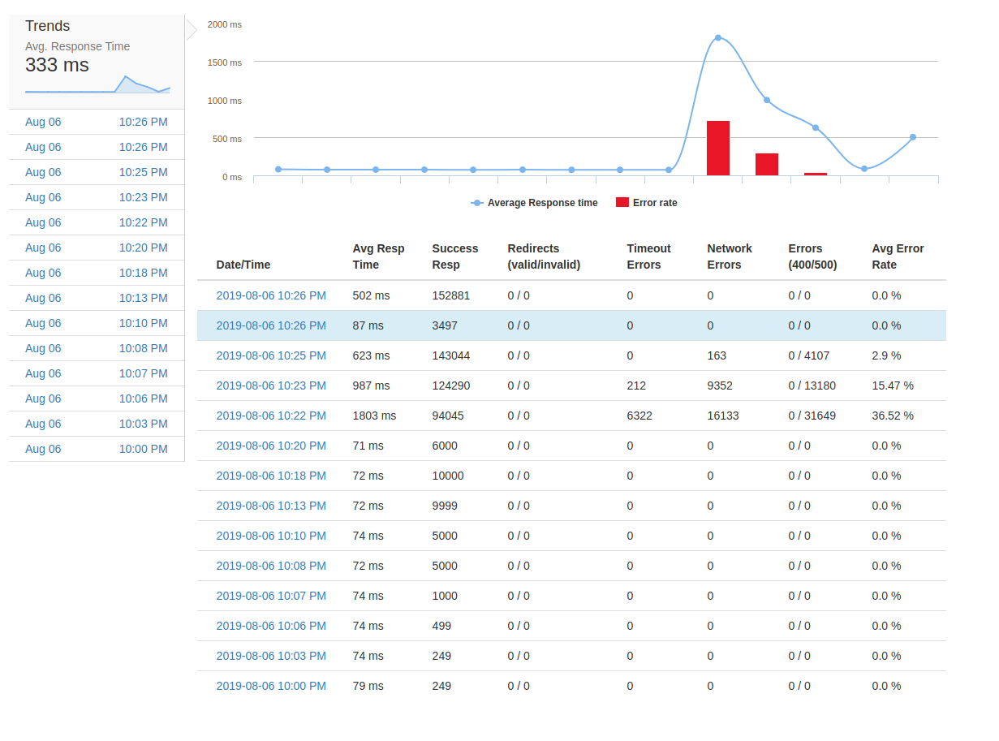
New Relic EC2 Service Get Results Loader.io Trends

## EC2 Proxy Results

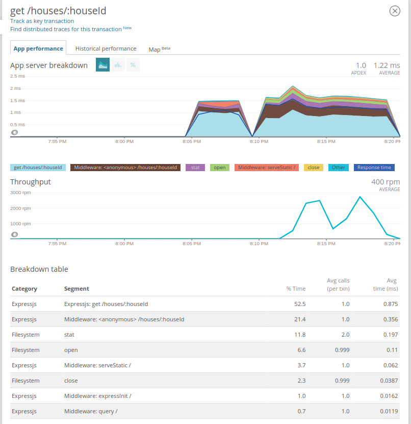
New Relic EC2 Proxy Get Results

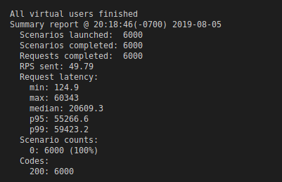
Artillery Commands

## EC2 Service Results

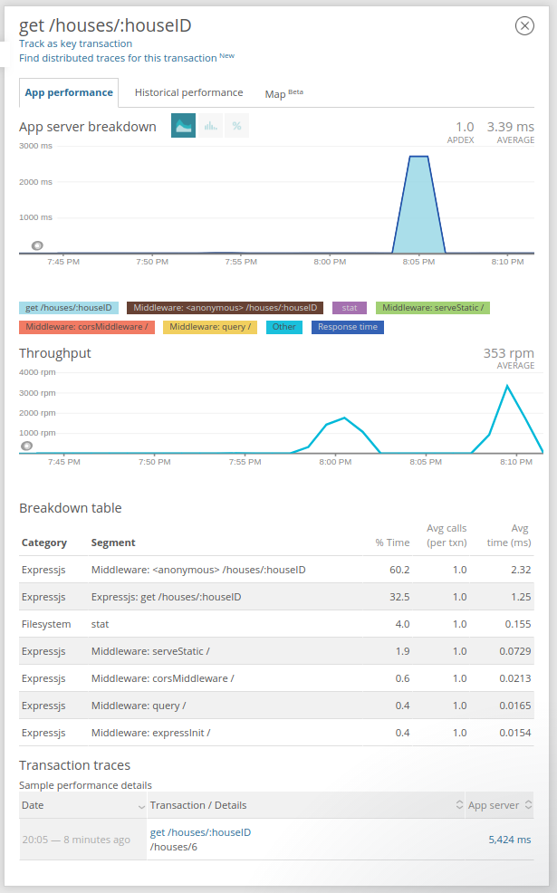
New Relic Service EC2 Get Results

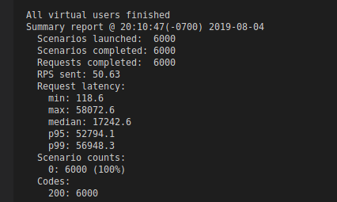
Artillery Commands

## New Relic Proxy Results (Local)

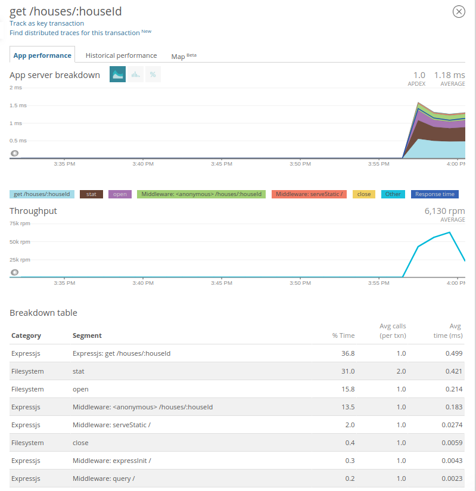
New Relic Get Local Results

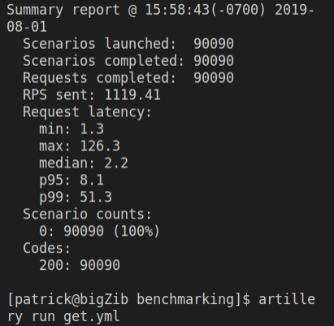
Artillery Commands

## New Relic Service Results (Local)

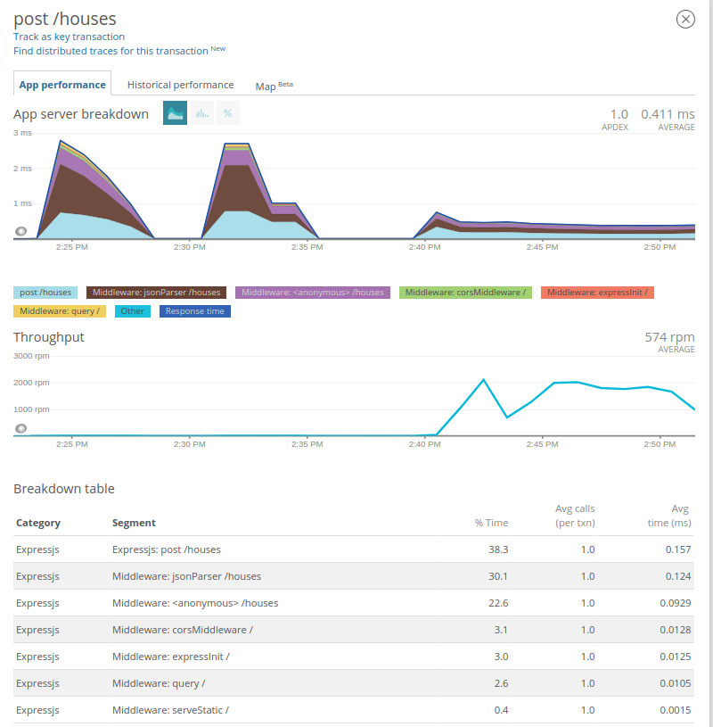
New Relic Post Results

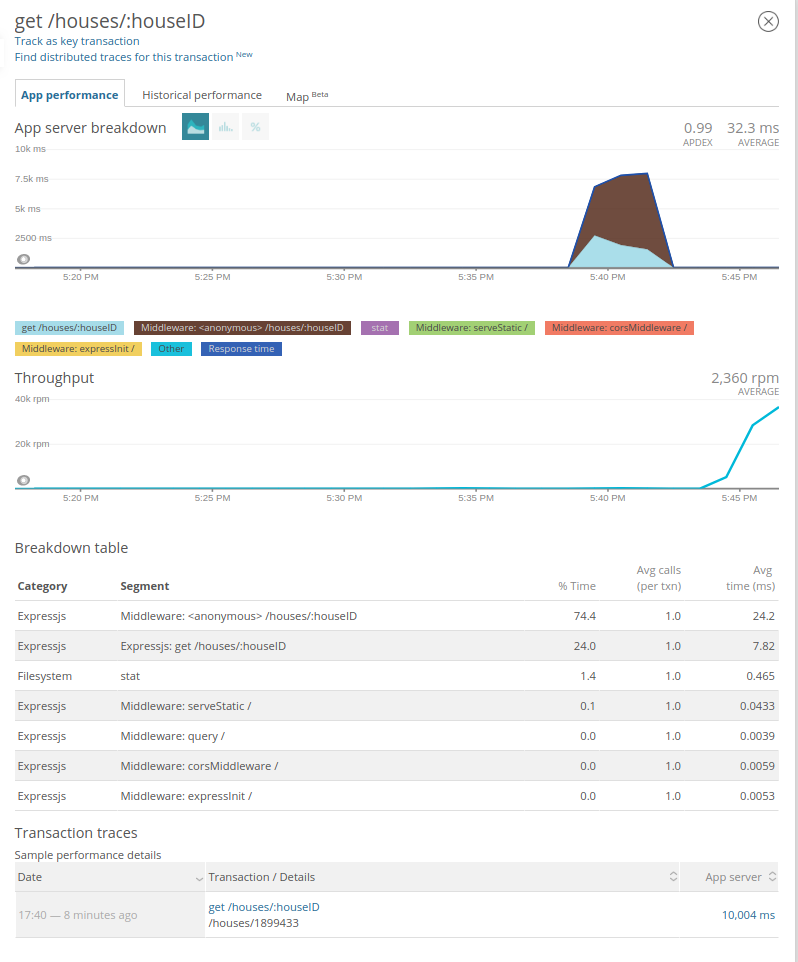
New Relic Get Results (Round 2)

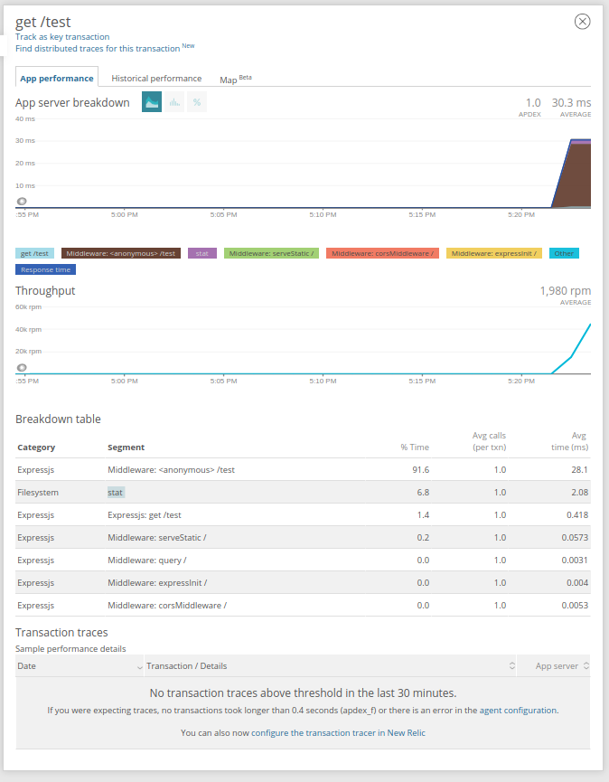
New Relic Get Results

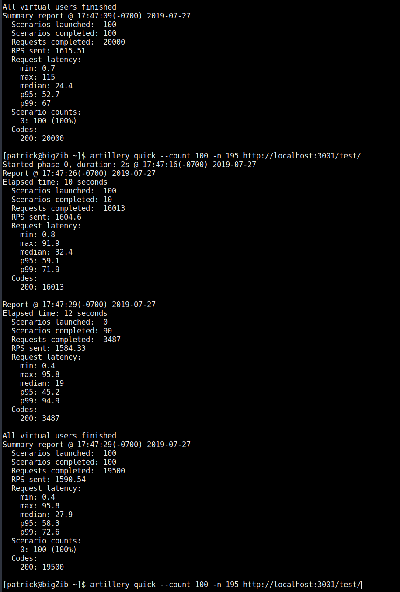
Artillery Commands

Express is the current bottleneck.

## Artillery Commands and References

<https://artillery.io/docs/getting-started/>

```sh
artillery quick --count 100 -n 75 http://localhost:3001/test/
```
