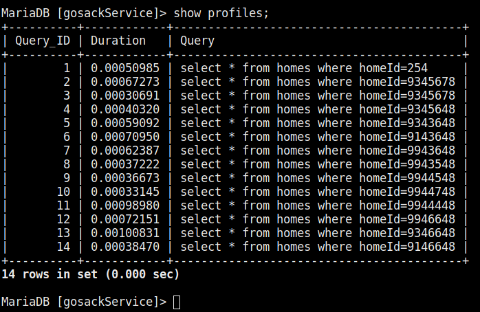

# Database Notes

## MariaDB

## Benchmarks

### Query Average

#### Maria DB



|Query #| Time |
|-|------------|	
|2|0.000672730s|	
|4|0.000403200s|
|5|0.000590920s|	
|6|0.000709500s|
|7|0.000623870s|	
|8|0.000372220s|	
|9|0.000366730s|	
|10|0.000331450s|	
|11|0.000989800s|
|12|0.00072151s|	
|13|0.00100831s|	
|14|0.00038470s|

|Average|
|-|
|597.9116667 µs|	
|0.5979116667 ms|	

```BASH
To start mysqld at boot time you have to copy
support-files/mysql.server to the right place for your system

Two all-privilege accounts were created.
One is root@localhost, it has no password, but you need to
be system 'root' user to connect. Use, for example, sudo mysql
The second is mysql@localhost, it has no password either, but
you need to be the system 'mysql' user to connect.
After connecting you can set the password, if you would need to be
able to connect as any of these users with a password and without sudo

See the MariaDB Knowledgebase at http://mariadb.com/kb or the
MySQL manual for more instructions.

You can start the MariaDB daemon with:
cd '/usr' ; /usr/bin/mysqld_safe --datadir='/var/lib/mysql'

You can test the MariaDB daemon with mysql-test-run.pl
cd '/usr/mysql-test' ; perl mysql-test-run.pl

Please report any problems at http://mariadb.org/jira

The latest information about MariaDB is available at http://mariadb.org/.
You can find additional information about the MySQL part at:
http://dev.mysql.com
Consider joining MariaDB's strong and vibrant community:
https://mariadb.org/get-involved/
```
Message after MariaDB package installation.

```SH
systemctl start mariadb
```
Start the mariadb service.

Data goes in `/var/lib/mysql`

```SQL
SELECT * FROM homes\G
```

Pretty Print Output

```SQL
SELECT COUNT(*) FROM student;
```
2
Count records in DB


### MariaDB Data Setup

```BASH
mysql -u patrick -p
```

Start Shell

```SQL
CREATE DATABASE IF NOT EXISTS test;
```
Create database `test`

```SQL
CREATE TABLE IF NOT EXISTS homes (
  BookID INT NOT NULL PRIMARY KEY AUTO_INCREMENT, 
  Title VARCHAR(100) NOT NULL, 
  SeriesID INT, AuthorID INT);
```

```SQL
CREATE TABLE IF NOT EXISTS homes (
   appliances TEXT,
   interiorFeatures TEXT,
   construction TEXT,
   roof TEXT,
   exterior TEXT,
   flooring TEXT,
   homeId INT PRIMARY KEY,
   homeAddress TEXT,
   price INT,
   beds INT,
   baths INT,
   rooms INT,
   stories INT,
   floorSize INT,
   spaces TEXT,
   houseDescription TEXT,
   houseType TEXT,
   yearBuilt INT,
   heating TEXT,
   cooling TEXT,
   parking INT,
   lotSize INT,
   daysListed INT,
   saves INT);
```
Create table `homes`

```SQL
LOAD DATA INFILE '/var/lib/mysql/data.csv'
INTO TABLE homes
FIELDS TERMINATED BY ';';
```

```SQL
LOAD DATA INFILE '/home/patrick/sdc/gosackService/sample-data/data/data.csv'
INTO TABLE homes
FIELDS TERMINATED BY ';';
```

Load Data

## Profiling

```SQL
SET PROFILING=1;
```

Enable profiling.

```SQL
SHOW PROFILES;
```

Show performance of last queries.


## Cassandra

* `cluster` is a container for `keyspaces`
* `keyspace` is the outermost container for data.
* `replication factor` the amount of nodes that will have duplicates of the data.
* `column family` roughly a table from a relational database

## `bash` Cassandra Helpers

```bash
sudo service cassandra active
```

```bash
nodetool status
```

```bash
cqlsh
```

## `cqlsh` Commands

```SQL
DESCRIBE keyspaces
```

List all keyspaces (outermost container for data) available.

```SQL
create keyspace dev ... with replication = {'class':'SimpleStrategy','replication_factor':1};
```

Create keyspace `dev`

```SQL
USE dev
```

Use keyspace `dev`

```SQL
create table emp (empid INT primary key, ... emp_first varchar, emp_last varchar, emp_dept varchar);
```

Create column family `emp` in keyspace dev

```SQL
insert INTO emp (empid, emp_first, emp_last, emp_dept) ... values (1,'fred','smith','eng');
```

Insert data INTo `emp`

```SQL
select count(*) from dev.emp;`
```

Count records in keyspace `dev` column family `emp`

```SQL
COPY generalDescriptionService.homes(appliances INTeriorFeatures,
construction,roof,exterior,flooring,homeId,homeAddress,price,beds,baths,rooms,stories,floorSize,spaces,houseDescription,houseType,yearBuilt,heating,cooling,parking,lotSize,daysListed,saves) FROM '~/data.csv' WITH DELIMITER=';' AND HEADER=TRUE;
```

import data

```SQL
drop table homes
```

Delete keyspace `homes`

```SQL
SELECT * FROM homes WHERE homeId=123;
```

Query example

`EXPAND ON`

Pretty Print

`TRACING ON`

Tracing on

## `generalDescriptionService` table

```sql
CREATE TABLE homes(
   appliances TEXT,
 INTeriorFeatures TEXT,
   construction TEXT,
   roof TEXT,
   exterior TEXT,
   flooring TEXT,
   homeId INT PRIMARY KEY,
   homeAddress TEXT,
   price INT,
   beds INT,
   baths INT,
   rooms INT,
   stories INT,
   floorSize INT,
   spaces TEXT,
   houseDescription TEXT,
   houseType TEXT,
   yearBuilt INT,
   heating TEXT,
   cooling TEXT,
   parking INT,
   lotSize INT,
   daysListed INT,
   saves INT
   );
```

## General Cassandra Use Case Notes

[ ] generate 10M records with node

cassandra - gossip
eventual consistency

* column oriented database
* key value pairs
* does not require empty positions to be filled with anything saving space
* fault tolerant, data is replicated to multiple nodes
* fast ***
* decentralized, no single p INT of failure
* scalable
* elastic, adding machines makes more performance
* no joins
* horizontal scaling to hit higher RPS

|Relational Database | NoSQL Database|
|-------------------|----------------|
|Handles data coming in low velocity|Handles data coming in high velocity|
|Data arrive from one or few locations|Data arrive from many locations|
|Manages structured data|Manages structured unstructured and semi-structured data.|
|Supports complex transactions (with joins)|Supports simple transactions
|single p INT of failure with failover|No single p INT of failure
|Handles data in the moderate volume.|Handles data in very high volume
|Centralized deployments|Decentralized deployments
|Transactions written in one location|Transaction written in many locations
|Gives read scalability|Gives both read and write scalability
|Deployed in vertical fashion|Deployed in Horizontal fashion

## CAP Theorem

* Available
* Consistant
* Partition Tolerant

Cassandra = AP
PostgreSQL = CA

artillery for hitting server to database


max conncections on single port
t2 large or bigger


cassandra
mariadb


<http://cassandra.apache.org/download/>

There are following features that Cassandra provides.

Massively Scalable Architecture: Cassandra has a masterless design where all nodes are at the same level which provides operational simplicity and easy scale out.
Masterless Architecture: Data can be written and read on any node.
Linear Scale Performance: As more nodes are added, the performance of Cassandra increases.
No Single p INT of failure: Cassandra replicates data on different nodes that ensures no single p INT of failure.
Fault Detection and Recovery: Failed nodes can easily be restored and recovered.
Flexible and Dynamic Data Model: Supports datatypes with Fast writes and reads.
Data Protection: Data is protected with commit log design and build in security like backup and restore mechanisms.
Tunable Data Consistency: Support for strong data consistency across distributed architecture.
Multi Data Center Replication: Cassandra provides feature to replicate data across multiple data center.
Data Compression: Cassandra can compress up to 80% data without any overhead.
Cassandra Query language: Cassandra provides query language that is similar like SQL language. It makes very easy for relational database developers moving from relational database to Cassandra.

## Random Thoughts

* need database for search optimised document store

* Redis for caching

Have leafs for increased read speed.
<https://mariadb.org/download/>
<https://medium.com/dev-bits/writing-memory-efficient-software-applications-in-node-js-5575f646b67f>