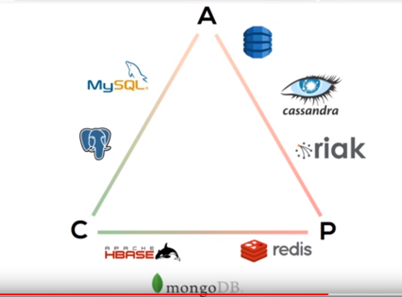

# SQL 
* mySQL
* Postgres
* SQlite

# need databasse for search optimised document store

# Redis for caching

Have leafs for increased read speed.
<https://mariadb.org/download/>
<https://medium.com/dev-bits/writing-memory-efficient-software-applications-in-node-js-5575f646b67f>z

# Cassandra

generate 10M records with node

cassandra - gossip
eventual consistency

* column oriented database
* key value pairs
* does not require empty positions to be filled with anything saving space
* fault tolerant, data is replicated to multiple nodes
* fast ***
* decentralized, no single point of failure
* scalable
* elastic, adding machines makes more performance
* no joins

## CAP Theorem

* Available
* Consistant
* Partition Tolerant

Cassandra = AP
PostgreSQL = CA

<http://cassandra.apache.org/download/>

`sudo service cassandra active`
`nodetool status`
`cqlsh`

"appliances":[],
"interiorFeatures":["Fireplace"],
"construction":"Modern",
"roof":"Tile",
"exterior":"Wood",
"flooring":"Laminate",
"_id":0,
"address":"  8103 Big Rock Cove St. \n  Grosse Pointe, MI 48236",
"price":1027926,
"beds":3,
"baths":1,
"rooms":4,
"stories":2,
"floorSize":3484,
"spaces":"N/A",
"description":"Lorem ipsum dolor sit amet, consectetur adipiscing elit. Ut vitae eros massa. Etiam pretium ex purus, vel tempus diam pretium eget. Curabitur hendrerit,
 tortor sed ultrices finibus, tortor eros condimentum tortor, ac mollis augue arcu sed felis. Vestibulum et aliquet ex. Aenean cursus elementum eleifend. Curabitur sit
 amet finibus mauris, et porttitor justo. Maecenas imperdiet euismod elit, eu dictum nibh faucibus quis. Pellentesque quis ullamcorper dolor. Morbi vestibulum eget
 ligula non venenatis.",
"type":"Townhouse",
"year":1932,
"heating":"Electric",
"cooling":"Central",
"parking":3,
"lotSize":9433,
"daysListed":18,
"saves":30