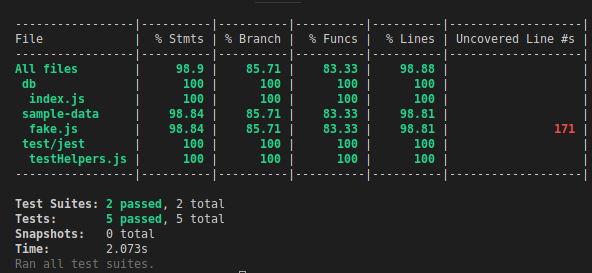

# SDC Journal

## 8/5/19

- Got all services in containers
- Pushed a service image to DockerHub
- Lots of bugfixes
- Ran into an issue where the image wouldn't build on the instance anymore, hence above.
- Had fun with some qnarly security issues, realized I had https disabled.
- Finally benchmarked the proxy.
- Learned that everything takes far more time than I think it should.

## 8/4/19

- Stress tested default service on AWS.

## 8/3/19

- Did a whole lot of messing around deploying the service.
- Learned a lot, accomplished little.
- Well, I got the service hosted on EC2, so I have that going for me.

## 8/2/19

- Wrote working dockerfile for DB.
- Wrote working bootstrap script for EC2.
- Got Docker container working locally
- Got Docker container working on EC2 instance.
- Very motivated for Terraform.
- Diagnosed another problem with my fake script.
- Uploaded big data file to S3 for eventual download.

## 8/1/19

- Proposed final mariaDB merge request.
- Added environment variables.
- All tests pass after changes, this was basically the first time I was really glad I had those tests. Totally see the value now...
- Got proxy working
- learned some crazy docker stuff
- learned some crazy terraform stuff

## 7/31/19

- Got axios HTTP requests working due to problem with async logic.
- Got Jest integration tests working with async axios requests.
- Benchmarked Service POST requests.
- Have satisfactory test coverage.
  - 
- Change SQL requests to guard against injections
- Changed status code handling on server.
- Wrote test for record generation performance.

## 7/30/19

- Housekeeping (ESLint for all files to conform to AirBnB Style Guide), file renaming, etc.
- createHouse query.
- updateHouse query.
- deleteHouse query.
- created query helper functions.
- updateHouse working.
- deleteHouse working.
- createHouse working.

## 7/29/19

- Incorperated comments into code from team lead.
- Abstracted functionality for server into model.
- Created Artillery script and seperated helper functions for benchmarking.
- Revised routes for proper error handling.
- Abstracted fake script for arbitrary record generation, output path. Added commandline arguments and export.
- Made CRUD stubs to complete tomorrow.
- Added Jest for tests to write tomorrow.

## 7/27/19

- Chose MariaDB based on metrics and research.
- Wrote database defense.
- Got basic querying working through nodejs.
- Have service working with MariaDB backend.
- Rebuilt data with address field due to mistake in generation.
- Looking at artillery for stress testing.

## 7/26/19

Loaded 10M records into MariaDB and have tested the speed of individual queries.
Documentation for this is in the [database](./database.md) file.
Completed benchmarking, but realized that I did not make an apples to apples
comparison as I was running Cassandra on the Windows Subsystem for Linux
and I ran MariaDB on an Arch Linux install. The performance of MariaDB was
7x faster and I find that a bit fishy...
Documentation for the benchmarks are in the [database](./database.md) file.

## 7/25/19

Loaded 10M records into cassandra and have tested the speed of individual queries.
Documentation for this is in the [database](./database.md) file.

## 7/24/19

Generated the 1e7 records required for database testing.
Have researched Cassandra and am beginning the insertion of the data for taking metrics.
